TL;DR: Eine robuste Simulation der F1‑Reifen‑Kerntemperatur entsteht aus (i) Energieerhaltung mit mehrschichtiger Wärmeleitung, (ii) viskoelastischer Verlustleistung (Hysterese) + Reibungsleistung (Slip) als Wärmequellen und (iii) realistischen Randbedingungen (Road/Air/Rim) samt Parameter‑Ranges und expliziter Unsicherheitsanalyse, weil ohne Materialdaten sonst viele Parametrierungen dieselbe Temperaturkurve erklären können. citeturn7view2turn6view3turn8view0turn5view2turn21view1

# Physikalisch‑analytisches Modell zur Simulation der F1‑Reifen‑Kerntemperatur

## Executive Summary

Eine „Kerntemperatur“ ist thermisch nicht nur ein Punktwert, sondern das Ergebnis eines (i) stark lokalisierten Heizeintrags im Kontaktfleck (tribologisch, zeitlich hochfrequent), (ii) volumetrischen Heizeintrags durch viskoelastische Dämpfung im Reifenaufbau (zyklische Deformation pro Radumdrehung), und (iii) vergleichsweise langsamer Wärmeleitung durch schlecht leitende Elastomere in Richtung Gürtel/Karkasse/Innenraum sowie in die Felge. citeturn5view2turn8view0turn6view3turn11view3turn21view1

Für die Simulation ohne reale Reifendaten ist der zentrale skeptische Punkt: **Das Problem ist unterbestimmt.** Viele Kombinationen aus Verlustmodul \(E''(T,\omega)\), Kontaktfleck‑Schubspannung \(\tau(x,y)\), Wärmeübergängen \(h\) und Kontaktwiderständen \(R_\mathrm{tc}\) erzeugen nahezu identische Kerntemperaturverläufe. Deshalb ist ein „physikalisch sauberer“ Aufbau zwar notwendig, aber nicht hinreichend: Sie brauchen zusätzlich (a) Parameter‑Priors aus Literatur, (b) bewusst einfache Kalibrier‑Targets (z. B. Warm‑up‑Zeitskalen), und (c) globales Sensitivitäts‑/UQ‑Gerüst. citeturn18search12turn8view2turn11view4turn7view1

Empfohlene Modell‑Roadmap (von „sofort implementierbar“ zu „hochfidel“):  
Ein mehrknotenbasiertes thermisches Netzwerk (Surface/Core/Inner‑Liner/Rim) liefert stabile Kerndynamik und ist schnell kalibrierbar; danach Ausbau zu 1D‑radialer Mehrschichtleitung; erst wenn nötig 2D (radial × umfangs) mit Rotationsadvektion; 3D‑FEM nur, wenn Sie lokale Hot‑Spots/Schulter‑Effekte oder Bauteil‑Interaktionen (Felge, Bremsen, Radabdeckung) wirklich auflösen müssen. citeturn5view2turn26view0turn8view0turn13view1

## Physikalische Grundlagen der Wärmeerzeugung

### Begriffsklärung: „Core“ vs. Oberfläche

In der Praxis existieren mindestens drei relevante Temperatur‑Skalen: (1) „Bulk/Core“ (tiefer im Aufbau, träge), (2) „tread bulk“ (Unterprofil/Deckschicht, mittlere Trägheit), (3) „flash temperature“ an Mikro‑Kontaktstellen (sehr schnell, lokal). Oberflächen‑IR misst meist (2)+(3), während „core“ eher (1) repräsentiert—und diese Größen können zeitweise entkoppelt sein. citeturn5view1turn21view2turn7view0turn5view2

### Viskoelastische Hysterese (volumetrischer Heizeintrag)

Für lineare Viskoelastizität unter harmonischer Dehnung \(\varepsilon(t)=\varepsilon_0\sin(\omega t)\) ergibt sich eine komplexe Steifigkeit \(E^\*(\omega)=E'(\omega)+iE''(\omega)\) mit Phasenwinkel \(\delta\) und \(\tan\delta=E''/E'\). Der pro Zyklus dissipierte Energieanteil pro Volumen ist (aus \(\int \sigma\,d\varepsilon\)) proportional zum Verlustmodul:  
\[
W_\mathrm{dis}/V = \pi\,E''(\omega,T)\,\varepsilon_0^2
\]
und die mittlere Verlustleistung (Wärmeleistung) wird
\[
\dot q_\mathrm{hyst} = f\,\pi\,E''(\omega,T)\,\varepsilon_0^2
= \frac{\omega}{2}\,E''(\omega,T)\,\varepsilon_0^2,
\]
analog für Schub mit \(G''(\omega,T)\) und \(\gamma_0\). Diese Beziehungen liefern Ihnen eine direkte Brücke von (geschätzten) Dehnungsamplituden im Kontakt/Sidewall‑Biegebereich zur Wärmequelle. citeturn6view3turn6view0turn6view2

Wie kommt \(\omega\) zustande? In der einfachsten Näherung setzt die dominante Anregungsfrequenz die Radumdrehungsfrequenz \(f_\mathrm{rot}=V/(2\pi R_\mathrm{eff})\), aber real ist ein breites Spektrum relevant (Profilblock‑Anregung, Rauheit, Slip‑Mikroschlupf). Eine konsequente Methode (FE‑basiert) ist, die Dehnungsamplituden pro Element über eine Radumdrehung zu bestimmen und die Hystereseverluste mit \(E''(T)\) zu verknüpfen; genau dieses Prinzip wird in 3D‑Reifen‑Temperaturrechnungen zur RR/Temperaturverteilung benutzt. citeturn8view0turn8view2turn5view2

### Reibungsleistung im Kontaktfleck (Oberflächenquelle) und Slip‑Regime

Im Kontaktfleck wird mechanische Leistung durch Schubspannungen \(\boldsymbol\tau\) bei lokaler Relativgeschwindigkeit \(\mathbf v_\mathrm{slip}\) in Wärme umgesetzt:
\[
\dot Q_\mathrm{fric} = \iint_{A_\mathrm{cp}} \boldsymbol\tau(x,y)\cdot \mathbf v_\mathrm{slip}(x,y)\,dA,
\qquad
\dot q''_\mathrm{fric}=\boldsymbol\tau\cdot \mathbf v_\mathrm{slip}
\]
Eine in vielen Echtzeit‑Thermoreifenmodellen genutzte, kontaktfleck‑gemittelte Form ist
\[
\dot Q_\mathrm{fric} \approx F_x\,v_x + F_y\,v_y,
\]
wobei \(v_x, v_y\) effektive Slip‑Geschwindigkeiten sind und \(F_x,F_y\) die resultierenden Kontaktkräfte. Diese Reduktion ist nützlich, aber sie versteckt lokale Hot‑Spots (Schulter, Vorderkante des Flecks, Ripp‑Effekte). citeturn9view4turn5view2

**Pure rolling** bedeutet idealisiert \(\mathbf v_\mathrm{slip}=0\) (keine Reibungswärme durch Gleiten), aber selbst dann entsteht Wärme durch Hysterese (Walkarbeit). **Rolling‑with‑slip** (Bremsen/Traktion/Lenken) erzeugt zusätzlich Oberflächenheizung durch (partielles) Gleiten. citeturn8view2turn9view4turn5view1

Kinematisch (Konventionen variieren) sind zwei Slips zentral:  
Longitudinal‑Slipratio \(\kappa\) (Bremsen/Traktion) über \(V\) und Radumfangsgeschwindigkeit \(\omega R_\mathrm{eff}\), z. B.
\[
\kappa = \frac{\omega R_\mathrm{eff}-V}{\max(V,\omega R_\mathrm{eff})},
\quad
v_{\mathrm{slip},x}\approx \kappa\,V \;\text{(kleine Slips)}
\]
und Slipwinkel \(\alpha\) (Lenken) mit näherungsweise \(v_{\mathrm{slip},y}\approx V\tan\alpha \approx V\alpha\) für kleine \(\alpha\). Diese Größen füttern Ihr Kraftmodell und damit die Reibleistung. citeturn13view1turn5view2

### Kontaktmechanik: Druckverteilung und „wo“ Wärme entsteht

Die Wärmequellen sind stark druck‑ und schubspannungsabhängig: \(\dot q''_\mathrm{fric}\propto \tau\,v_\mathrm{slip}\) und \(\tau\) hängt von Normaldruck \(p(x,y)\), Reibgesetz \(\mu(\cdot)\) und lokaler Zustandsgröße (Temperatur, Rauheit, Wasserfilm) ab. Eine minimal‑physikalische Kontaktfleck‑Parametrisierung ist:  
\[
p(x,y)=p_0\,\Pi(x,y),\qquad \iint_{A_\mathrm{cp}}\Pi\,dA=A_\mathrm{cp},\qquad \iint_{A_\mathrm{cp}}p\,dA=F_z
\]
mit z. B. elliptischer Lastverteilung \(\Pi(x,y)=\left(1-(x/a)^2-(y/b)^2\right)_+\). Ohne Messdaten ist das weniger „wahr“ als „nützlich“: Es gibt Ihnen eine kontrollierbare Struktur, um Empfindlichkeiten gegenüber Schulter‑Last, Camber‑Verschiebung und Flecklänge zu testen. citeturn5view2turn13view1

Ein wesentlicher tribologischer Realismus‑Check: Bei Gummi auf rauen Straßen ist die **reale Kontaktfläche** oft nur ein Bruchteil der nominellen Fläche, und ein großer Anteil der Reibung kann hysteretisch (Rauheits‑induzierte zyklische Deformation) sein; in multiskaligen Theorien wird deshalb explizit die Wärmeleitungsgleichung mit einer räumlichen Wärmequellendichte gekoppelt. citeturn5view1turn13view0turn13view2

## Wärmeübertragung und Randbedingungen

### Grundgleichungen der Wärmeleitung im Mehrschichtkörper

Für den Reifen als inhomogenen (und im Gürtel i. d. R. anisotropen) Körper gilt die Energiebilanz in Differentialform (Fourier‑Leitung + volumetrische Quellen):
\[
\rho(T)\,c_p(T)\,\frac{\partial T}{\partial t}=\nabla\cdot\!\left(\mathbf k(T)\,\nabla T\right)+\dot q_\mathrm{gen}
\]
mit \(\mathbf k\) als Leitfähigkeits‑Tensor (z. B. Gürtel: höhere Leitfähigkeit in Umfangsrichtung wegen Cord‑/Stahlanteil). citeturn7view2turn5view2turn8view0

Wenn Sie Umfangs‑Nichtuniformität (Kontaktfleck als wandernde Wärmequelle) modellieren, kommt in mitrotierenden Koordinaten ein Advektions‑Term hinzu:
\[
\rho c_p\left(\frac{\partial T}{\partial t}+\omega\frac{\partial T}{\partial \theta}\right)=\nabla\cdot(\mathbf k\nabla T)+\dot q_\mathrm{gen}(\theta,t),
\]
wobei \(\omega\) die Winkelgeschwindigkeit ist. Das ist der sauberste Weg, „periodisches Heizen im Kontaktfleck“ ohne 3D‑Vollmodell abzubilden. citeturn7view2turn26view0turn5view2

### Randbedingungen außen: Luftkonvektion, Strahlung, Solar

Außen (tread/sidewall) ist eine gemischte Randbedingung üblich:
\[
-\mathbf n\cdot(\mathbf k\nabla T)=\dot q''_\mathrm{fric}(\theta,t) - h_\mathrm{out}(V_\mathrm{rel})\,(T-T_\infty)
-\varepsilon\sigma\,(T^4-T_\mathrm{rad}^4) + \alpha_\mathrm{sol}\,G_\mathrm{sol}\,\chi_\mathrm{proj}
\]
Hier ist \(h_\mathrm{out}\) geschwindigkeitsabhängig (erzwungene Konvektion). Ein in Reifenthermomodellen verwendeter Ansatz ist, den Reifen als quer angeströmten Zylinder zu approximieren und \(h\) über dimensionslose Korrelationen zu bestimmen. citeturn9view4turn5view5turn5view2

Als robuste Default‑Option (breiter Re‑Bereich) eignet sich die Churchill‑Bernstein‑Korrelation für Zylinder‑Querströmung (liefert \(\overline{\mathrm{Nu}}_D\) aus \(\mathrm{Re}_D,\mathrm{Pr}\)), daraus \(h=\mathrm{Nu}\,k_\mathrm{air}/D\). Sie müssen akzeptieren, dass das für einen rotierenden, strukturierten Reifen nur eine Näherung ist (typisch „engineering‑genau“, nicht CFD‑genau). citeturn5view5turn4search8turn7view2

### Randbedingungen im Kontaktfleck: Leitung in die Straße und Wärmeaufteilung

Der Kontaktfleck koppelt Reifen und Asphalt thermisch. Zwei Effekte müssen getrennt werden:

Erstens die **Reibungswärme** (Oberflächenquelle), die zwischen Reifen und Straße aufgeteilt wird. Eine klassische, materialbasierte Sicht ist: die Aufteilung hängt von thermischen Eigenschaften beider Körper (\(\rho, c, \alpha\)) und vom Bewegungszustand ab; in analytischen Lösungen für gleitende Kontakte erscheinen explizite Quotienten aus \(\rho c\sqrt{\alpha}\) (verwandt zur thermischen „Effusivität“) als Aufteilungsparameter. citeturn21view1turn21view2turn7view0

Ein praktikabler Parameterisierungs‑Vorschlag (für Ihr Simulations‑Framework, nicht als „Naturkonstante“):  
\[
\eta_\mathrm{tire} \in [0,1],\qquad 
\dot q''_{\mathrm{fric},\mathrm{tire}}=\eta_\mathrm{tire}\,\dot q''_\mathrm{fric},\qquad
\dot q''_{\mathrm{fric},\mathrm{road}}=(1-\eta_\mathrm{tire})\,\dot q''_\mathrm{fric},
\]
wobei \(\eta_\mathrm{tire}\) als Funktion der Materialkennwerte und ggf. \(\mathrm{Pe}\) (Peclet‑Zahl) kalibriert bzw. aus Kontakt‑Theorie abgeleitet werden kann. citeturn21view1turn19search0turn7view0

Zweitens die **thermische Leitung** zwischen Reifenoberfläche und Straßensubstrat (wenn sie unterschiedliche Bulk‑Temperaturen haben). Das lässt sich als Kontakt‑Wärmeübergang \(h_\mathrm{cp}\) abbilden:
\[
-\mathbf n\cdot(\mathbf k\nabla T)\big|_\mathrm{tire} = h_\mathrm{cp}\,(T_\mathrm{tire,surf}-T_\mathrm{road,surf})
\]
mit sehr großer Unsicherheit, weil Mikro‑Kontaktfläche, Rauheit und Gummi‑Weichheit stark variieren. citeturn7view1turn4search2turn21view1turn13view0

### Randbedingungen innen: Gasraum und Felge, inkl. Kontaktwiderstand

Innen sind zwei Pfade relevant: Wärmeabgabe an das Inflationsgas (natürliche Konvektion) und Wärmeleitung/‑kontakt in die Felge (Bead‑Bereich). Viele physikalische Reifenthermomodelle bilden beide explizit ab: \(h_\mathrm{in}\) für Gas‑Konvektion und ein „Rim‑Knoten“ mit Kontaktleitwert/‑widerstand. citeturn5view2turn9view4turn7view1

Wichtig ist **thermischer Kontaktwiderstand**: Selbst bei formschlüssigem Kontakt ist die reale Kontaktfläche wegen Rauheit klein, was zu einem Temperaturabfall über der Grenzfläche führt. Klassische Arbeiten zur „thermal contact conductance“ modellieren diesen Widerstand als Funktion von Anpressdruck, Rauheit und Materialpaarung. Praktisch implementieren Sie:
\[
q = h_c\,A\,(T_1-T_2),\qquad R_\mathrm{tc}=\frac{1}{h_c\,A}
\]
und behandeln \(h_c\) als kalibrierbaren (oder druckabhängigen) Parameter. citeturn7view1turn4search2turn4search3

Reglement‑relevanter Randbedingungs‑Hinweis: Für F1‑Felgen sind bestimmte Materialien und Geometrien vorgeschrieben; außerdem sind explizit Features/Oberflächen, die die Wärmeübertragungseigenschaften der Felge beeinflussen, verboten—das reduziert die Modellfreiheit beim „Wärmesenken‑Tuning“. citeturn16view0

## Reifenaufbau, Materialmodelle und Parameterbereiche

### Aufbau und Schichtenmodell als thermisches Netzwerk

Moderne Radialreifen lassen sich thermisch sinnvoll als Mehrschicht‑Stack modellieren: Lauffläche (Cap/Base), cap ply, Gürtel (Stahlcord), Karkasse (Textilcord‑Komposit), Innerliner (Butyl/Halobutyl), Wulst/Bead‑Verstärkungen und der Kontakt zur Felge. Das ist nicht nur Geometrie: jede Schicht hat eigene \(k(T)\), \(c_p(T)\), \(\rho(T)\) und viskoelastische Verluste. citeturn11view0turn11view2turn5view2turn11view3

image_group{"layout":"carousel","aspect_ratio":"16:9","query":["tire cross section diagram tread belt carcass inner liner bead","radial tire construction layers diagram tread steel belt carcass","slick racing tire cross section diagram tread belt carcass"] ,"num_per_query":1}

### F1‑Geometrie: sinnvolle Startwerte, wo Reglement hilft

Für F1‑Implementierungen ist es rational, offizielle Reglement‑Geometrie als Fixpunkt zu nutzen, weil sie Ihre Unsicherheit stark reduziert:

- Felgendurchmesser und Felgenbreite (Front/Rear) sind im \u200bentity["organization","FIA (Fédération Internationale de l’Automobile)","motorsport governing body"]‑Reglement tabelliert (z. B. Rim Diameter 462.6 mm; Tyre Mounting Width Front 315 mm, Rear 401.3 mm). citeturn16view0  
- Der Einsatz von Druck‑/Temperatur‑Sensorik ist vorgeschrieben (TPMS). citeturn16view1  
- Für aktuelle 18‑Zoll‑F1‑Reifengrößen (Beispielangaben) veröffentlicht \u200bentity["company","Pirelli","tyre manufacturer"] Nennmaße wie „Front 305/720‑18“ und „Rear 405/720‑18“. citeturn14search1

Achtung: Für 2026 werden (laut Hersteller/Reglement‑Kommunikation) veränderte Reifenabmessungen diskutiert/angekündigt; behandeln Sie Reifendurchmesser/‑breiten daher als Versions‑Input, nicht als Konstante. citeturn14search12turn16view0

### Thermische Materialkennwerte und plausible ranges

Ohne proprietäre Reifedaten brauchen Sie belastbare Literatur‑Ranges (als Priors):

Für Naturkautschuk (als Größenordnung für Elastomer‑Komponenten) sind angegeben:  
\(\rho\approx 0.91\text{–}0.93\,\mathrm{g/cm^3}\), \(c_p\approx 1.91\text{–}2.08\,\mathrm{J/(g\,K)}\) und \(k\approx 0.13\text{–}0.15\,\mathrm{W/(m\,K)}\); außerdem CTE \(\alpha_L\approx 180\text{–}260\times 10^{-6}\,\mathrm{K^{-1}}\). citeturn11view3

Die Wärmeleitfähigkeit von Reifen‑Elastomeren ist stark compound‑abhängig; als Faustbereich werden für verschiedene Gummis \(k\sim 0.09\) bis \(0.3\,\mathrm{W/(m\,K)}\) genannt, mit nur schwacher Temperaturabhängigkeit über 0–100 °C (einige %). Im Umkehrschluss ist die **thermische Diffusivität** \(\alpha=k/(\rho c_p)\) sehr klein und macht den Reifen thermisch träge. citeturn11view4turn7view0turn11view3

Für Innerliner‑Schichten sind Dicken um \(\sim 1.0\,\mathrm{mm}\) dokumentiert (Halobutyl‑Innerliner) – für Ihre Modellgeometrie ist das relevant, weil der Innerliner nicht nur Gasbarriere, sondern auch thermischer Widerstand ist. citeturn22search3turn22search11

Für Asphalt variieren thermische Kennwerte stark mit Porosität und Mischung; als grobe Range können Sie \(k_\mathrm{asphalt}\sim 0.5\,\mathrm{W/(m\,K)}\) (vereinfachte Datenbanken) bis \(>1\,\mathrm{W/(m\,K)}\) (andere Literaturübersichten) ansetzen; \(c_p\) typischerweise im Bereich \(\sim 800\text{–}1850\,\mathrm{J/(kg\,K)}\). Nutzen Sie das vor allem zur Abschätzung der Wärmeaufteilung Reifen↔Straße. citeturn14search3turn14search27turn21view1

### Viskoelastische Stoffmodelle: Generalized Maxwell/Prony + WLF

Für Gummi in einem Simulationscode ist die pragmatische, gut dokumentierte Wahl: lineare Viskoelastizität als Generalized‑Maxwell‑Kette (Prony‑Reihe) für Relaxationsmodul:
\[
E(t)=E_\infty+\sum_{i=1}^N E_i\,e^{-t/\tau_i},
\]
woraus sich \(E'(\omega),E''(\omega)\) im Frequenzraum ergeben (und damit direkt \(\dot q_\mathrm{hyst}\)). Diese Darstellung ist Standard in FE‑Software und Literatur zur Parameteridentifikation. citeturn0search13turn0search37turn6view0turn6view3

Die Temperaturabhängigkeit der Zeit-/Frequenzskala wird über Zeit‑Temperatur‑Superposition modelliert. Die klassische WLF‑Shift‑Funktion (benannt nach entity["people","Malcolm L. Williams","polymer scientist"], entity["people","Robert F. Landel","polymer scientist"] und entity["people","John D. Ferry","polymer scientist"]) ist:
\[
\log_{10} a_T = -\frac{C_1\,(T-T_\mathrm{ref})}{C_2+(T-T_\mathrm{ref})},
\]
mit in der Originalarbeit berichteten universellen Konstantenformen (je nach Wahl des Referenzpunktes, z. B. relativ zu \(T_g\)). Für Reifen ist das wichtig, weil „Reibung vs. Geschwindigkeit“ und „Verlustmodul vs. Frequenz“ temperaturverschoben sind. citeturn10view0turn6view4turn5view1turn13view0

## Mathematisches Gesamtsystem

### Komplette Variablenliste mit Einheiten

Die folgende Liste ist so strukturiert, dass Sie 1:1 eine Parameter‑/State‑Definition daraus ableiten können (SI‑Basiseinheiten; Temperaturen vorzugsweise in Kelvin intern).

| Kategorie | Symbol | Bedeutung | Einheit |
|---|---:|---|---:|
| Thermischer Zustand | \(T(\mathbf x,t)\) | Temperaturfeld im Reifen | K |
|  | \(T_\mathrm{core}(t)\) | definierte Kerntemperatur (Node/Volumenmittel) | K |
|  | \(T_\mathrm{surf}(\theta,y,t)\) | Oberflächentemperatur (tread/sidewall) | K |
|  | \(T_\infty\) | Umgebungslufttemperatur | K |
|  | \(T_\mathrm{road}\) | Straßentemperatur (Bulk oder Oberfläche) | K |
|  | \(T_\mathrm{rim}\) | Felgentemperatur | K |
| Material | \(\rho(T)\) | Dichte | kg m\(^{-3}\) |
|  | \(c_p(T)\) | spezifische Wärmekapazität | J kg\(^{-1}\) K\(^{-1}\) |
|  | \(\mathbf k(T)\) | Wärmeleitfähigkeits‑Tensor | W m\(^{-1}\) K\(^{-1}\) |
|  | \(\alpha(T)=k/(\rho c_p)\) | thermische Diffusivität | m\(^2\) s\(^{-1}\) |
|  | \(E'(T,\omega),E''(T,\omega)\) | Speicher-/Verlustmodul | Pa |
|  | \(G',G''\) | Schub‑Moduli | Pa |
|  | \(\tan\delta\) | Verlustfaktor | – |
|  | \(\nu(T,t)\) | Poissonzahl (ggf. zeit-/temp‑abhängig) | – |
|  | \(\alpha_L(T)\) | thermische Längenausdehnung | K\(^{-1}\) |
| Geometrie | \(R_\mathrm{eff}\) | effektiver Rollradius | m |
|  | \(D\) | Außendurchmesser | m |
|  | \(w\) | Reifenbreite | m |
|  | \(\delta_i\) | Schichtdicken (tread, belt, carcass, liner, …) | m |
|  | \(A_\mathrm{cp}\) | nominelle Kontaktfläche | m\(^2\) |
|  | \(a,b\) | Halbachsen elliptischer Druckverteilung | m |
| Betrieb | \(V(t)\) | Fahrzeuggeschwindigkeit | m s\(^{-1}\) |
|  | \(\omega(t)\) | Raddrehzahl | rad s\(^{-1}\) |
|  | \(F_z(t)\) | Radlast | N |
|  | \(\gamma(t)\) | Camber | rad |
|  | \(\alpha(t)\) | Slipwinkel | rad |
|  | \(\kappa(t)\) | Longitudinal‑Slipratio | – |
|  | \(F_x,F_y\) | Kontaktkräfte | N |
|  | \(T_b\) | Bremsmoment | N m |
| Kontakt/Tribologie | \(p(x,y)\) | Normaldruckverteilung | Pa |
|  | \(\tau_x,\tau_y\) | Schubspannung | Pa |
|  | \(\mu(\cdot)\) | Reibkoeffizient (modelliert) | – |
|  | \(\mathbf v_\mathrm{slip}\) | Slipgeschwindigkeit lokal | m s\(^{-1}\) |
| Wärmequellen | \(\dot q_\mathrm{hyst}\) | volumetrische Hysteresequelle | W m\(^{-3}\) |
|  | \(\dot q''_\mathrm{fric}\) | Reibwärmefluss | W m\(^{-2}\) |
|  | \(\eta_\mathrm{tire}\) | Wärmepartitionsfaktor in den Reifen | – |
| Wärmeübergänge | \(h_\mathrm{out}(V)\) | Außenkonvektion | W m\(^{-2}\) K\(^{-1}\) |
|  | \(h_\mathrm{in}\) | Innenkonvektion (Gas) | W m\(^{-2}\) K\(^{-1}\) |
|  | \(h_\mathrm{cp}\) | Kontakt‑Wärmeübergang Reifen↔Straße | W m\(^{-2}\) K\(^{-1}\) |
|  | \(h_c\) | Kontaktleitwert Reifen↔Felge (Bead) | W m\(^{-2}\) K\(^{-1}\) |
|  | \(\varepsilon\) | Emissivität | – |
|  | \(\sigma\) | Stefan‑Boltzmann‑Konstante | W m\(^{-2}\) K\(^{-4}\) |
| Umwelt | \(V_\mathrm{wind}\) | Windgeschwindigkeit | m s\(^{-1}\) |
|  | RH | relative Luftfeuchte | – |
|  | \(G_\mathrm{sol}\) | Solarirradianz | W m\(^{-2}\) |

Die Einheitenkonventionen und die Form der Wärmeleitungsgleichung folgen Standard‑Wärmeübertragungslehre; die viskoelastischen Größen \(E',E'',\tan\delta\) folgen linearer Viskoelastik. citeturn7view2turn6view3turn11view3turn5view2

### Governing Equations mit Annahmen und Herleitungen

**Annahme A (Thermal):** Kontinuum, lokale thermische Gleichgewichte pro Materialpunkt, Fourier‑Leitung. citeturn7view2  
**Annahme B (Mechanik→Thermik‑Kopplung):** Wärmequellen sind (i) viskoelastische Dissipation im Volumen und (ii) Reibungsdissipation an der Kontaktoberfläche, ggf. verteilt über Partition. citeturn6view3turn9view4turn21view1  
**Annahme C (Viskoelastik):** linear viskoelastisch im Frequenzbereich pro Zeitschritt, mit Temperatur‑Shift \(a_T(T)\) (WLF) und ggf. amplitudenabhängiger Korrektur als Kalibrierterm. citeturn10view0turn0search13turn8view0

#### Wärmeleitung im Mehrschichtreifen

Startpunkt:
\[
\rho c_p\frac{\partial T}{\partial t}=\nabla\cdot(\mathbf k\nabla T)+\dot q_\mathrm{hyst}(\mathbf x,t)
\]
mit Schicht‑Materialfunktionen \(\rho_i(T),c_{p,i}(T),\mathbf k_i(T)\). Interfacebedingungen zwischen Schichten \(i\) und \(i+1\):
\[
T_i=T_{i+1},\qquad \mathbf n\cdot(\mathbf k_i\nabla T_i)=\mathbf n\cdot(\mathbf k_{i+1}\nabla T_{i+1})
\]
(bei perfektem Kontakt); bei imperfect contact ersetzt durch
\[
q=\frac{T_i-T_{i+1}}{R_\mathrm{tc}}.
\]
citeturn7view2turn7view1turn4search2

#### Herleitung der Hysteresequelle aus \(E''\)

Für harmonische Belastung ist die dissipierte Energie pro Volumen
\[
W_\mathrm{dis}/V=\oint \sigma\,d\varepsilon,
\]
und mit komplexen Spannungsanteilen folgt die bekannte Beziehung \(W_\mathrm{dis}=\pi\sigma_0''\varepsilon_0=\pi E''\varepsilon_0^2\). Multipliziert mit der Zyklusfrequenz \(f\) ergibt das die mittlere Wärmeleistung pro Volumen \(\dot q_\mathrm{hyst}=f\pi E''\varepsilon_0^2\). citeturn6view3turn6view0

In einem Mehrfach‑Achsen‑Zustand (Reifen im Kontakt) verwenden Sie einen effektiven Verlustterm:
\[
\dot q_\mathrm{hyst} \approx \pi f\;\boldsymbol\varepsilon_a^\mathsf T\,\mathbf C''(T,\omega)\,\boldsymbol\varepsilon_a,
\]
wobei \(\boldsymbol\varepsilon_a\) die Dehnungs‑Halbamplitude ist und \(\mathbf C''\) ein Verlust‑Steifigkeitstensor (oder empirisch ein skalierter \(E''\)‑Ansatz). In FE‑basierter Reifenwärmeberechnung wird dieses Prinzip über elementweise Dehnungsamplituden implementiert und \(E''(T)\) iterativ mit dem Temperaturfeld gekoppelt. citeturn8view0turn6view3turn0search13

#### Reibungsleistung, Aufteilung und „road conduction“

Als Oberflächenrandbedingung im Kontaktbereich:
\[
-\mathbf n\cdot(\mathbf k\nabla T)=\eta_\mathrm{tire}\,\mu(p,T,v)\,p\,|\mathbf v_\mathrm{slip}|
\quad(\text{Kontaktfleck}),
\]
außerhalb des Kontaktflecks durch Konvektion/Strahlung. Für eine Kraft‑basierte Reduktion:
\[
\dot Q_\mathrm{fric}\approx F_x v_x + F_y v_y,
\]
und für die Wärmestromdichte im Reifen teilen Sie durch eine Modell‑Kontaktfläche \(A_\mathrm{cp}\) (Achtung: nominell vs. real). citeturn9view4turn5view2turn5view1

Für Leitung in die Straße als zusätzliche Senke/Quelle:
\[
-\mathbf n\cdot(\mathbf k\nabla T)=h_\mathrm{cp}(T_\mathrm{tire,surf}-T_\mathrm{road,surf}),
\]
wobei \(h_\mathrm{cp}\) nicht mit aerodynamischem \(h\) zu verwechseln ist und stark von Rauheit, Kontaktdauer und Materialpaarung abhängt. Analytische Arbeiten zur Wärmeverteilung zwischen gleitenden Oberflächen zeigen explizit, dass Materialkennwerte und Relativgeschwindigkeit die Wärmeaufteilung dominieren, und liefern Formeln/Skalierungen für Aufteilungsfaktoren. citeturn21view1turn21view2turn7view0

#### Rolling‑Resistance‑basiertes Energiemodell (nützlich ohne Detail‑Dehnungsfelder)

Wenn Ihnen Dehnungsamplituden fehlen, ist ein kontrollierbarer Ersatz: Rolling‑Resistance als global dissipierte Leistung,
\[
\dot Q_\mathrm{RR}=F_\mathrm{RR}\,V = C_\mathrm{RR}\,F_z\,V,
\]
und diese Leistung wird als volumetrische Wärmequelle über Schichten verteilt (Gewichtungen \(\phi_i\), \(\sum \phi_i=1\)). Rolling resistance wird explizit als hysteresegetrieben beschrieben und ist frequenz-/geschwindigkeitsabhängig; relevante Standards definieren \(C_\mathrm{RR}\) und betonen den Bedarf an thermischer Konditionierung/Warm‑up. citeturn8view2turn24view0turn8view3turn6view3

### Kopplung mit Fahrdynamik und Druckverteilung

Sie brauchen eine Kopplungsschleife: Fahrzeugdynamik → Reifenkräfte/Slips → Wärmequellen → Temperaturfeld → temperaturabhängige Reibung/viskoelastische Moduli → zurück in Kräfte/Slips. Real‑Time‑Reifenthermomodelle beschreiben diese Ko‑Simulation explizit und koppeln (i) Reibleistung im Kontaktfleck und (ii) zyklische Deformationsheizung. citeturn5view2turn8view3turn13view1

Das schwächste Glied ohne Messdaten ist die Kontaktmechanik. Hier sind drei konsistente Modelloptionen, von denen keine „frei von Annahmen“ ist:

| Option | Was Sie modellieren | Vorteil | Risiko ohne Daten |
|---|---|---|---|
| Druckverteilung analytisch (Ellipse/Winkler) | \(A_\mathrm{cp}(F_z,p_\mathrm{infl})\), \(p(x,y)\) parametrisch | schnell, stabil, sensitivitätsfreundlich | Schulter‑Hotspots/Camber‑Verschiebung nur grob |
| Semi‑empirisches Kraftmodell (z. B. Magic‑Formula‑Familie) | \(F_x(\kappa,\alpha,F_z,T)\), \(F_y(\cdot)\) | direkt an Fahrdynamik anschließbar | Parameter ohne Reifendaten schwer identifizierbar citeturn3search6turn3search2turn5view2 |
| Mechanik‑FEM + Thermik | Dehnungsfelder, lokale Dissipation | physikalisch reich, lokal | extrem daten- und rechenhungrig citeturn8view0turn13view1 |

## Numerische Umsetzung und Stabilität

### Diskretisierungs‑Empfehlung (Meshes, Zeitschritt, Parameter)

**Baseline (empfohlen): 1D radial, Mehrschicht, implizit.**  
Diskretisieren Sie radial durch alle Schichten (tread cap/base, belt, carcass, liner) mit nicht‑uniformem Gitter: feiner nahe Außenoberfläche und Gürtel, weil dort die größten Gradienten auftreten. Für Slick‑Racing‑Reifen sind „tread thickness“ im mm‑Bereich plausibel (3–4.5 mm wurde als typische Größenordnung für Slicks genannt), was eine radiale Kantenauflösung von \(\Delta r\sim 0.2\text{–}0.5\,\mathrm{mm}\) sinnvoll macht, wenn Sie Oberflächendynamik überhaupt abbilden wollen. citeturn14search2turn22search12turn11view3

**Zeitschrittwahl:**  
Für explizite FTCS‑Schemata gilt Stabilität ungefähr mit
\[
\Delta t \le \frac{\Delta r^2}{2\alpha_\mathrm{max}}
\]
(1D), wobei \(\alpha\) bei Gummi sehr klein ist, aber \(\Delta r\) ebenfalls klein wird; Sie landen leicht bei \(\Delta t\sim 0.01\text{–}0.1\,\mathrm{s}\), wenn Sie nahe Oberflächenknoten fein machen. Ein praktischer und robuster Weg ist BTCS oder Crank‑Nicolson (implizit), womit Sie stabil bleiben und \(\Delta t\) nach Genauigkeit wählen. citeturn26view0turn3search1turn7view2

**Wenn Sie Umfangs‑Advektion aufnehmen (2D r×θ):**  
Neben Diffusion kommt eine CFL‑artige Forderung aus Advektion:
\[
\Delta t \lesssim \frac{\Delta \theta}{\omega}
\]
wenn Sie explizit behandeln; implizite Behandlung reduziert Stabilitätsprobleme, nicht aber Phasenfehler bei zu grobem Zeitschritt. citeturn26view0turn7view2

### Algorithmischer Workflow

Ein implementierbarer Workflow (pro Zeit‑Schritt) sieht konsistent so aus:

1) Eingänge lesen: \(V,F_z,\alpha,\kappa,\gamma,T_\infty,T_\mathrm{road},V_\mathrm{wind},G_\mathrm{sol},\dots\)  
2) Kontaktfleck schätzen: \(A_\mathrm{cp}\), \(p(x,y)\) oder nur Mittelwerte.  
3) Kraft/Slip‑Modell: \(F_x,F_y\) und/oder \(\mathbf v_\mathrm{slip}\).  
4) Wärmequellen berechnen: \(\dot q_\mathrm{hyst}\) (volumetrisch), \(\dot q''_\mathrm{fric}\) (Kontakt).  
5) Wärmepartition Reifen↔Straße anwenden.  
6) Randbedingungen \(h_\mathrm{out}(V_\mathrm{rel})\), Strahlung, Innenkonvektion, Felgenkontakt.  
7) Wärmeleitung lösen (FD/FVM/FEM), Temperaturen updaten.  
8) Temperaturabhängige Eigenschaften aktualisieren: \(E''(T)\) via WLF‑Shift, \(k(T),c_p(T)\), \(\mu(T,\cdot)\).  
9) (Optional) Iteration pro Zeitschritt, bis Quelle↔Temperatur konsistent ist (staggered). citeturn8view0turn5view2turn10view0turn9view4turn26view0

Pseudocode (minimal, ohne Implementierungsdetails Ihrer Fahrdynamik):

```pseudo
state: T_nodes[layer, r_index, (theta_index)]  # temperatures
params: geometry, material_props(T), heat_transfer_coeffs, calib_factors

for each time step n:
    inputs = vehicle_dynamics(t_n)  # V, Fz, alpha, kappa, camber, forces/torques
    env    = environment(t_n)       # T_amb, wind, T_road, solar, humidity
    
    # 1) contact patch & kinematics
    A_cp, p_field = contact_patch_model(inputs, geometry, T_nodes)
    v_slip_field  = slip_kinematics(inputs, geometry, p_field)
    
    # 2) friction model -> shear stress and frictional heat flux
    mu_field      = friction_model(p_field, v_slip_field, T_surface, material_props)
    tau_field     = mu_field * p_field * direction(v_slip_field)
    q_fric_total  = integrate(tau_field · v_slip_field over A_cp)
    q_fric_tire   = eta_tire(...) * q_fric_total
    
    # 3) hysteresis heat generation (choose one)
    if have_strain_amplitudes:
        eps_amp = strain_amplitude_model(inputs, geometry, p_field)
        Epp     = loss_modulus(material_props, T_nodes, omega=rot_freq(V))
        q_hyst  = pi * f_rot * (eps_amp^T * Cpp * eps_amp)  # per volume
    else:
        Q_RR    = C_RR(T_core, inputs, ...) * Fz * V
        q_hyst  = distribute(Q_RR over layers/volumes with weights phi_i)
    
    # 4) boundary conditions (air/road/rim + radiation)
    h_out = convection_outside(V_rel=V+wind)
    h_in  = convection_inside(...)
    bc    = assemble_boundary_conditions(h_out, h_in, q_fric_tire, T_road, radiation, rim_contact)
    
    # 5) solve heat equation (implicit preferred)
    T_nodes = solve_heat_conduction(T_nodes, q_hyst, bc, dt)
    
    # 6) update temperature-dependent properties (WLF shift etc.)
    material_props = update_material_props(T_nodes)
    
    outputs: T_core = extract_core_temperature(T_nodes)
```

### Modelloptionen und Trade‑offs (Tabellen)

**Raummodell‑Tiefe vs. Aufwand**

| Modell | Zustand | Wärmequellen | Vorteile | Hauptnachteile |
|---|---|---|---|---|
| Lumped 2–6 Knoten | \(T_\mathrm{surf},T_\mathrm{core},T_\mathrm{liner},T_\mathrm{rim}\) | \(\dot Q_\mathrm{RR},\dot Q_\mathrm{fric}\) | extrem schnell, gut kalibrierbar | keine Gradienten/Hot‑spots citeturn5view2 |
| 1D radial Mehrschicht | \(T_i(r)\) pro Schicht | volumetrisch + Randflüsse | solide Kerntemp, physikalische Leitpfade | Umfangsuniformität angenommen citeturn7view2turn26view0 |
| 2D r×θ (mit Rotation) | \(T(r,\theta)\) | wandernder Kontaktfleck | Kontaktfleck‑Periodik, Schulter‑Asymmetrien | mehr Parameter, numerisch anspruchsvoller citeturn7view2turn5view2 |
| 3D FEM | \(T(x,y,z)\) | lokal elementweise | höchste Detailtreue | Daten/CPU dominieren citeturn8view0turn13view1 |

**Wärmequellen‑Modelle**

| Quelle | Modellform | Parameter, die fehlen können | Kalibrier‑Hebel |
|---|---|---|---|
| Hysterese | \(\dot q_\mathrm{hyst}\propto E''\varepsilon_0^2 f\) | \(\varepsilon_0\), \(E''(T,\omega)\) | Skalenfaktor auf \(\varepsilon_0\) oder \(E''\) citeturn6view3turn8view0 |
| Rolling‑Resistance proxy | \(\dot Q=C_\mathrm{RR}F_zV\) | \(C_\mathrm{RR}(T)\) | Normierung an Warm‑up‑Zeitskala citeturn24view0turn8view2 |
| Reibung | \(\dot Q=\iint \tau v_\mathrm{slip} dA\) oder \(F_xv_x+F_yv_y\) | \(\mu(\cdot)\), \(A_\mathrm{real}/A_\mathrm{cp}\), Partition \(\eta\) | \(\eta\), \(\mu(T,v)\), real‑area‑Faktor citeturn9view4turn21view1turn5view1 |

**Reibungsmodelle (inkl. Stribeck‑Option)**

| Regime | Minimalmodell | Erweiterung | Wann sinnvoll |
|---|---|---|---|
| Trocken/„Race slick“ | \(\mu=\mu_0(T)\) mit Peak‑Fenster | viskoelastische+adhäsive Summenmodelle (Grosch/Persson‑gedanklich) | wenn \(\mu\)–Temp–Speed‑Peak wichtig ist citeturn12search1turn5view1turn13view2 |
| Übergang mit Film (nass) | Stribeck‑Kurve \(\mu(H)\) (Hersey‑Zahl) | Mischreibung + Temperatur‑Gesetz | Wet‑Running, Wasserfilm, Aquaplaning‑Proxy citeturn12search0turn12search20turn12search12 |

**Kritischer Hinweis:** Stribeck ist tribologisch primär für geschmierte/mixed Kontakte entwickelt; für trockene Reifen‑Asphalt‑Reibung ist es meist nicht die dominante Physik. Nutzen Sie es als „Nass‑/Film‑Modul“, nicht als Default‑Trockenmodell. citeturn12search12turn13view2

## Kalibrierung, Sensitivität, Validierung und Szenarien

### Kalibrierung ohne echte Reifendaten: was ist identifizierbar?

Ohne Messdaten sind absolute Temperaturen nur als **Band** verlässlich. Identifizierbar sind eher: Zeitkonstanten (Warm‑up/Cool‑down), relative Sensitivitäten (mehr Camber → andere Schulterheizung), und qualitative Phasenabhängigkeiten (Push‑Lap vs. Lift‑and‑Coast). Rolling‑Resistance‑Standards zeigen explizit, wie stark Warm‑up/thermische Konditionierung die Messgröße beeinflussen—das ist ein Indiz, dass Ihre Simulation mindestens diese thermische Trägheit nachbilden muss. citeturn24view0turn8view3turn8view2

Praktisches Kalibrier‑Set (wenn wirklich keine Daten existieren):  
Setzen Sie Literatur‑Priors für \(k,\rho,c_p\) (relativ gut bekannt) und behandeln Sie die schlecht beobachtbaren Größen—\(\eta_\mathrm{tire}\), \(h_\mathrm{cp}\), „effective strain amplitude“ oder \(C_\mathrm{RR}\)—als Kalibrierparameter mit großen Unsicherheiten. citeturn11view3turn7view1turn21view1turn8view2

### Sensitivitätsanalyse und Unsicherheitsquantifizierung

Für ein solches Modell ist globale Sensitivität rationaler als lokale Ableitungen, weil Parameter stark nichtlinear gekoppelt sind (z. B. \(E''(T)\) via WLF verschiebt Frequenzen exponentiell). Standardwerke zur globalen Sensitivität empfehlen variance‑basierte Indizes (Sobol/Saltelli) und effiziente Stichprobenpläne wie Latin Hypercube Sampling. citeturn18search12turn18search1turn18search0

Ein minimaler UQ‑Plan, der in Code sofort umsetzbar ist:

- Definieren Sie Verteilungen für z. B. \(k\), \(c_p\), \(h_\mathrm{out}\), \(h_\mathrm{cp}\), \(\eta_\mathrm{tire}\), \(C_\mathrm{RR}\), \(a_T\)-Parameter. citeturn11view3turn11view4turn10view0turn5view5  
- Nutzen Sie LHS für \(N\sim 200\text{–}2000\) Runs (je nach Modellkosten) und reporten Sie Konfidenz‑Bänder von \(T_\mathrm{core}(t)\). citeturn18search1turn18search12  
- Berechnen Sie Sobol‑Indizes, um zu sehen, ob Ihr Ergebnis primär durch „Wärmequelle“ oder „Wärmesenke“ determiniert wird—typischerweise ist das ein häufig übersehener Erkenntnisgewinn. citeturn18search0turn18search12

### Validierungsstrategien und Surrogat‑Experimente (empfohlen)

Wenn später irgendeine Validierung möglich ist, sind die folgenden Experimente (auch als „Surrogat“ im Labormaßstab) besonders wertvoll, weil sie direkt auf Ihre unbestimmten Parameter zielen:

- DMA‑Messungen eines tread‑repräsentativen Compounds: Masterkurven \(E'(\omega),E''(\omega)\) und \(a_T(T)\) (WLF‑Fit) → direkt für \(\dot q_\mathrm{hyst}\) und \(\mu(T,V)\)-Shifts nutzbar. citeturn10view0turn6view3turn13view0  
- Rolling‑Resistance‑Rig (oder Rollenprüfstand) zur Zeitkonstante: Warm‑up bis Stabilisierung liefert thermische Trägheit und effektive Dissipationsleistung; Standards geben Warm‑up‑Prozeduren/Definitionen. citeturn24view0turn8view2  
- Pin‑on‑disc / Tribometer auf Asphalt‑ähnlichen Oberflächen: \(\mu(v,T)\) und Wärmepartition/flash‑Tendenzen; analytische Kontakt‑Wärmeverteilungsmodelle geben Ihnen Vergleichsformeln. citeturn21view1turn12search1turn5view1

### Beispiel‑Szenarien und qualitative Kerntemperaturverläufe

Die folgenden Szenarien sind synthetisch (keine realen Telemetriedaten) und dienen nur dazu, zu zeigen, **wie** Ihr Modell qualitativ reagieren sollte: Push‑Phase → schneller Anstieg, Management → Plateau, Cool‑down → exponentieller Abfall (dominiert von \(h_\mathrm{out}\), \(h_c\) und thermischer Masse). Das ist im Einklang mit dem physikalischen Aufbau (Dissipation ↔ Wärmeleitung ↔ Konvektion/Strahlung). citeturn5view2turn8view2turn7view2turn9view4

```mermaid
gantt
    title Synthetische Fahrphasen (Zeit in Sekunden, nicht maßstabsgetreu zu echter F1-Telemetrie)
    dateFormat  X
    axisFormat  %s s

    section Rennstint
    Outlap / Warm-up      :a1, 0, 120
    Push-Laps             :a2, 120, 480
    Management            :a3, 600, 900
    Inlap                 :a4, 1500, 300

    section Qualifying
    Outlap                :b1, 0, 60
    Push-Lap              :b2, 60, 55
    Cool-down             :b3, 115, 35

    section Cool-down
    Lift & Coast          :c1, 0, 120
    Slow / Pit-entry      :c2, 120, 180
```




*Interpretation der Plot‑Form (nicht der Absolutwerte):* Der Rennstint zeigt ein Aufheizen Richtung Quasi‑Stationär, anschließend leichtes Abkühlen im Inlap; die Qualifying‑Phase erzeugt einen kleineren Core‑Anstieg, weil der Core träge ist und kurze Push‑Events zunächst stärker an der Oberfläche wirken; der Cool‑down fällt mit einer Zeitkonstante, die durch Außenkonvektion und Felgenpfad bestimmt wird (effektiv ein thermisches RC‑Netz). citeturn7view2turn26view0turn5view2turn9view4

### Priorisierte Quellen und „wo die Wahrheit liegt“

Wenn Sie später Daten beschaffen können, sind diese Quellenklassen (in dieser Reihenfolge) am wertvollsten:

Erstens: Reglement und offizielle Geometrie/Constraints über \u200bentity["organization","FIA (Fédération Internationale de l’Automobile)","motorsport governing body"] (Felgendaten, erlaubte/verbote Wärmeeinflüsse). citeturn16view0turn16view1

Zweitens: Reifenspezifischen Hersteller‑Output (Dimensionen, Compound‑Fenster, ggf. technische Bulletins) von \u200bentity["company","Pirelli","tyre manufacturer"] und—falls zugänglich—interne Motorsport‑„tyre data booklets“ (oft nicht öffentlich). citeturn14search1turn14search12

Drittens: Primärliteratur zu Viskoelastik und Temperatur‑Shift: WLF‑Originalarbeit und lineare Viskoelastik‑Herleitungen für \(E',E'',\tan\delta\) und Dissipation. citeturn10view0turn6view3

Viertens: Primärliteratur zur Gummireibung und ihren Temperatur‑/Geschwindigkeits‑Peaks (Grosch‑Masterkurven; multiskalige Hysterese-/Adhäsionsmodelle, z. B. von entity["people","B. N. J. Persson","tribology physicist"]; systematische Experimente von entity["people","K. A. Grosch","rubber tribologist"]). citeturn5view1turn12search1turn13view2turn13view0

Fünftens: Thermische Reifenmodelle (real‑time/3D), die Fourier‑Diffusion, Kontaktfleck‑Management, Innenraum‑Konvektion und Reibleistung zusammenbringen; solche Modelle zeigen praktisch, wie man die Kopplung implementiert und welche Randbedingungen dominieren. citeturn5view2turn9view4turn3search3

Sechstens: Kontakt‑Wärmeaufteilung/Theorie (Jaeger/Blok‑Nachfolger, Wärmeverteilung nach entity["people","J. R. Barber","contact mechanics researcher"]) und Kontaktwiderstand‑Literatur (klassische thermal‑contact‑conductance‑Modelle). citeturn21view1turn21view2turn7view1turn4search2

Für Modellierungspraxis (Standards): Rolling‑Resistance‑Definitionen und Warm‑up‑Prozeduren aus ISO‑Standards sind hilfreich, weil sie zeigen, welche thermischen Bedingungen bei Messungen als Referenz angesehen werden (z. B. 25 °C Referenzumgebung, capped inflation, Warm‑up). \u200bentity["organization","ISO","standards body"]. citeturn24view0

Wenn Sie an zugängliche SAE‑Papers kommen (oft paywalled), lohnt sich eine gezielte Suche in \u200bentity["organization","SAE International","mobility engineering org"] nach „tire thermal model“, „thermal property characterization of tyre rubber“ und „rolling resistance temperature distribution“. citeturn2search9turn0search34

### Annahmen und Limitierungen

Ohne reale Materialdaten ist jede absolute Vorhersage (z. B. „Core ist exakt 103 °C“) wissenschaftlich nicht verteidigbar; verteidigbar sind hingegen (i) physikalisch konsistente Trends, (ii) Bandbreiten, (iii) Sensitivitäts‑Rangfolgen, und (iv) Modellvergleiche (z. B. „Kontakt‑Wärmeübergang dominiert gegenüber Außenkonvektion“). Genau deshalb ist UQ kein „Nice‑to‑have“, sondern Teil der Physik‑Ehrlichkeit. citeturn18search12turn7view1turn11view4turn8view2